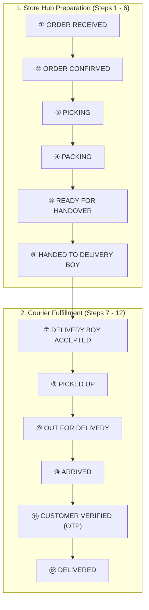

# 🌱 FreshMart — Enterprise Quick-Commerce Grocery Platform

FreshMart is a full-stack, production-grade quick-commerce grocery delivery platform featuring real-time 12-step serial order lifecycle tracking, customer location-based serviceability, role-based access control (Owner, Staff, Delivery Partner, Customer), strict basket data isolation, and live audio-visual notifications.

---

## 📁 Production Folder Structure

The project is organized into a modular, scalable, enterprise-grade architecture:

```
FreshMart/
├── frontend/                                # User Interfaces
│   ├── customer-store/                     # Customer Storefront (HTML, Scripts, Styles)
│   │   ├── index.html                      # Storefront Home & Hero
│   │   ├── vegetables.html                 # Farm-Fresh Vegetables Catalog
│   │   ├── fruits.html                     # Orchard Fruits Catalog
│   │   ├── grocery.html                    # Daily Essentials & Staples
│   │   ├── offers.html                     # Value Combos & Daily Deals
│   │   ├── product-details.html            # Product Details & Nutrition
│   │   ├── checkout.html                   # Cart Review & Checkout Flow
│   │   ├── scripts/                        # Customer Client Scripts (app.js, auth.js, location.js, etc.)
│   │   └── styles/                         # CSS Styles & Animations (styles.css)
│   ├── owner-dashboard/                    # Owner & Management Portals
│   │   ├── owner.html                      # Store Owner Live Operations & 12-Step Serial Controls
│   │   ├── admin.html                      # Administrative Analytics & Catalog Management
│   │   └── hub.html                        # Hub Order Preparation & Dispatch Terminal
│   └── delivery-dashboard/                 # Delivery Courier Partner Portal
│       └── delivery.html                   # Courier Real-Time Deliveries & OTP Handover
│
├── backend/                                # Node.js Server Architecture
│   ├── api/                                # API Entry & SSE Broadcaster
│   │   ├── index.js                        # Master API Request Handler
│   │   └── events.js                       # Real-time SSE Broadcaster Hub
│   ├── controllers/                        # HTTP Request / Response Handlers
│   │   ├── authController.js               # Authentication & Session Handlers
│   │   ├── cartController.js               # User-Isolated Basket Handlers
│   │   ├── orderController.js              # Order Lifecycle & 12-Step Serial Transitions
│   │   ├── productController.js            # Products & Categories Handlers
│   │   ├── customerController.js           # Customer Profile & Address Book
│   │   ├── deliveryController.js           # Courier Scoped Deliveries & Status Updates
│   │   ├── ownerController.js              # Store Metrics & Staff RBAC Handlers
│   │   └── locationController.js           # Geocoding & Serviceability Verification
│   ├── services/                           # Pure Business Logic Layer
│   │   ├── authService.js                  # Authentication Business Logic
│   │   ├── cartService.js                  # Cart Calculation & Isolation Logic
│   │   ├── orderService.js                 # 12-Step Serial State Machine Engine
│   │   ├── deliveryService.js              # Courier Allocation & Handover Logic
│   │   ├── productService.js               # Product Catalog Operations
│   │   ├── ownerService.js                 # Store Metrics & Staff Administration
│   │   ├── emailService.js                 # Email Delivery & Receipt Templates
│   │   ├── locationService.js              # Geocoding & Radius Distance Calculations
│   │   ├── paymentService.js               # COD Reconciliation & Wallet Debits
│   │   └── notificationService.js          # Live Event Dispatching
│   ├── middleware/                         # HTTP Middleware
│   │   ├── authMiddleware.js               # Session Token Extraction & Auth Verification
│   │   ├── rbacMiddleware.js               # Role-Based Checks (Owner, Staff, Courier)
│   │   ├── rateLimiter.js                  # IP & Identifier Rate Limiters
│   │   └── corsMiddleware.js               # CORS & Security Header Handlers
│   ├── routes/                             # Domain Route Modules
│   │   ├── authRoutes.js                   # /api/auth/*
│   │   ├── cartRoutes.js                   # /api/cart/*
│   │   ├── orderRoutes.js                  # /api/orders/*
│   │   ├── deliveryRoutes.js               # /api/delivery/*
│   │   ├── ownerRoutes.js                  # /api/owner/*
│   │   ├── productRoutes.js                # /api/products/*
│   │   ├── customerRoutes.js               # /api/customer/*, /api/addresses/*
│   │   └── locationRoutes.js               # /api/locations/*, /api/location/check
│   ├── validators/                         # Payload Validation Schemas
│   │   ├── authValidator.js
│   │   ├── orderValidator.js
│   │   ├── cartValidator.js
│   │   ├── productValidator.js
│   │   └── deliveryValidator.js
│   └── repositories/                       # Data Access Layer
│       ├── userRepository.js
│       ├── cartRepository.js
│       ├── orderRepository.js
│       ├── productRepository.js
│       ├── deliveryRepository.js
│       └── addressRepository.js
│
├── database/                               # Database Engine & Persistence
│   ├── connection.js                       # Singleton Database Connection Interface
│   ├── schemas/                            # JSON / Markdown Schema Specifications
│   ├── migrations/                         # Schema Migration Scripts
│   ├── seeders/                            # Initial Seed Data Scripts
│   └── indexes/                            # In-Memory Secondary Query Indexer
│
├── shared/                                 # Shared Assets Across Layers
│   ├── types/                              # Data Model Type Definitions
│   ├── enums/                              # OrderStatus, UserRoles, PaymentMethods, DeliveryStatus
│   ├── constants/                          # Fees, Radius Thresholds, Timeouts, Error Codes
│   └── utilities/                          # Crypto Hashing, Date Math, Geo Calculations, JSON Response
│
├── authentication/                         # Dedicated Auth Subsystem (Google OAuth, Sessions)
├── payments/                               # Payments Subsystem (COD, Razorpay, Wallet Credits)
├── notifications/                          # Notifications Subsystem (SSE Hub, Email, Audio Alerts)
├── storage/                                # Media & File Asset Manager
├── config/                                 # App & Environment Configurations
├── tests/                                  # Comprehensive Automated Test Suites
├── docs/                                   # Architecture, API & Deployment Documentation
├── deployment/                             # Dockerfile, Docker Compose, Nginx Config
├── data/                                   # Database Storage (db.json)
├── server.js                               # Root Server Entrypoint
└── package.json                            # Scripts & Dependencies
```

---

## 🚀 Quick Start & Running Locally

### Prerequisites
- Node.js (v18.x or higher)
- npm (v9.x or higher)

### Installation
```bash
# Clone the repository
git clone https://github.com/your-org/FreshMart.git
cd FreshMart

# Install dependencies
npm install

# Start the server
npm start
```

The application runs on `http://localhost:8080` with the following access URLs:
- **Customer Storefront**: `http://localhost:8080/`
- **Owner Dashboard**: `http://localhost:8080/owner`
- **Delivery Partner Portal**: `http://localhost:8080/delivery`
- **Admin Console**: `http://localhost:8080/admin.html`
- **Real-Time Event Stream**: `http://localhost:8080/api/events`

---

## 🧪 Running Automated Test Suites

The test suite thoroughly covers all critical security, isolation, and workflow requirements:

```bash
# 1. Run User Basket & Cart Isolation Test
node tests/test_cart_user_isolation.js

# 2. Run 12-Step Serial Order Status Workflow Test
node tests/test_serial_order_workflow.js

# 3. Run End-to-End Order-to-Delivery Lifecycle Test
node tests/test_complete_order_to_delivery_lifecycle.js

# 4. Run Delivery Partner Order Scoping Test
node tests/test_delivery_real_orders.js

# 5. Run Staff & Role-Based Access Control Test
node tests/test_staff_rbac_inprocess.js

# 6. Run Location & Serviceability Test
node tests/test_location_system.js
```

---

## 🔄 12-Step Serial Order Lifecycle

FreshMart enforces a strict step-by-step workflow state machine. Out-of-order state skipping is strictly rejected:



---

## 📦 Deployment

### Docker Container Deployment
```bash
# Build and run Docker container
docker build -t freshmart:latest -f deployment/Dockerfile .
docker run -d -p 8080:8080 --name freshmart_app -v $(pwd)/data:/app/data freshmart:latest
```

### Docker Compose
```bash
cd deployment
docker-compose up -d
```

### Production Nginx Reverse Proxy
Deploy `deployment/nginx.conf` to `/etc/nginx/sites-available/freshmart` for high-performance reverse proxying and SSE support.

---

## 📄 License
MIT License © 2026 FreshMart Enterprise.
